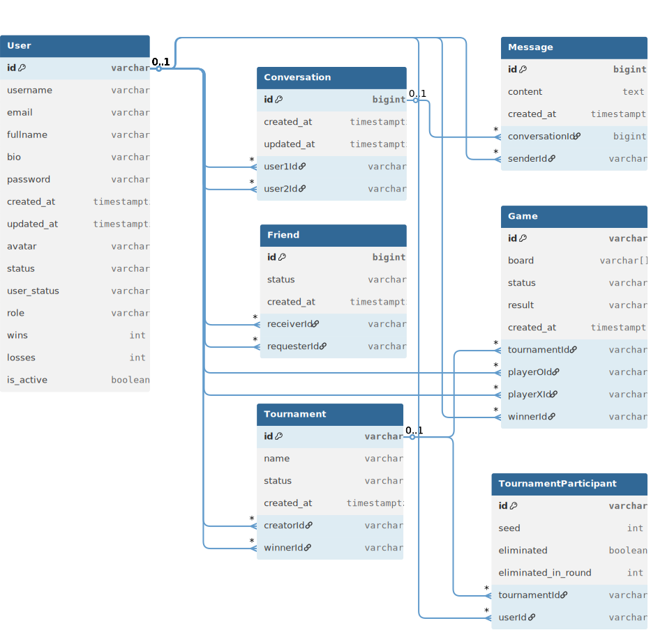
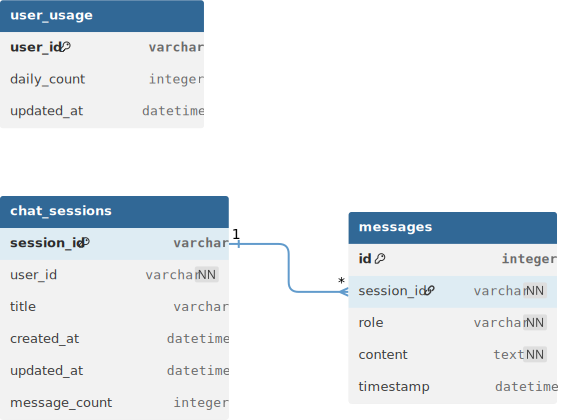

*This project has been created as part of the 42 curriculum by eismail, ysouhail, sahamzao, mait-taj,  bouhammo*

# Tic-tac-toe Arena

---

## Description

**Tic-tac-toe Arena** is a full-stack, real-time competitive multiplayer platform where users challenge each other in tic tac toe game, earn XP, climb the leaderboard, practice with AI opponent, participate in a tournament, connect through live chat with your friends or with Ai.

### Key Features

- **Real-time 1v1 gameplay** — Live matches with synchronized turns.
- **Multiple game modes** — Ranked matches, tournaments, and AI practice.
- **Live chat & notifications** — Instant messaging and activity alerts.
- **Friends & invitations** — Add friends and challenge them directly.
- **Leaderboard & stats** — Rankings, match history, and performance insights.
- **LLM Chatbot Interface** — AI-powered chatbot with session-based conversations.
- **Responsive UI** — Smooth experience across mobile and desktop.

---

## Team Information

| Member | 42 Login | Role | Responsibilities |
|--------|----------|------|------------------|
| **Ismail** | `eismail` | **Product Owner (PO)** | Defined the product vision and feature priorities. Built the entire game backend: the game engine. the matchmaking system (1v1 friend invitations, disconnect/reconnection handling), tournament system, the leaderboard (global rankings, player statistics), and the dashboard (XP overview, match history).|
| **Mouhamed** | `mait-taj` | **Project Manager (PM)** | Coordinated sprint planning and team workflow. Developed front and back-end of the real-time chat service (Socket.IO messaging, presence tracking, message persistence) and the friend system, And user profile management |
| **sayf** | `sahamzao` | **Tech Lead** | Made architecture decisions and led code reviews. Developed the authentication service (JWT login/signup, session management), OAuth 2.0 integration with 42 Intra, avatar uploads, Built the infrastructure layer: Docker Compose orchestration, Nginx reverse proxy with TLS termination, ModSecurity WAF configuration, HashiCorp Vault setup with AppRole auth and Vault Agent, and security hardening. |
| **Youssef** | `ysouhail` | **Developer** | Built almost the entire frontend: React SPA architecture, responsive design across all screen sizes, page layouts, UI components, real-time UI integration with Socket.IO.|
| **Brahim** | `bouhammo` | **Developer** | Built the AI services: the Tic-tac-toe AI opponent engine (Q-learning, difficulty logic, Q-table serving) and the chatbot API (Flask app setup, DB initialization, session/chat endpoints, error handling and rate limiting) |
---

## Project Management

### How Work Was Organized

The team followed a simple, service-based workflow:

- **Service ownership** — Each microservice was primarily owned by one member, with knowledge transfer sessions to avoid silos.
- **Service-based branching** — Each service had its own branch, then merged via pull requests after review.
- **Code review** — Pull requests were reviewed by at least one other team member before merging.
- **Daily standups** — Short synchronization meetings to unblock progress and align priorities.

### Tools Used

- **Trello** — Task tracking, bug reports, and feature requests.
- **Git** — Version control with feature branching and pull request workflow.

### Communication Channels

- **Discord** — Primary communication channel for daily standups, quick questions, and screen sharing sessions.
- **In-person meetings** — Weekly planning sessions at the 1337 Med campus.

---

## Technical Stack

### Frontend

| Technology | Version | Justification |
|------------|---------|---------------|
| **React** | 19.2 | Component-based UI with hooks and mature ecosystem. |
| **React Router** | 7.13 | Client-side routing for SPA navigation. |
| **Vite (Rolldown Vite)** | 7.2 | Fast dev server and optimized builds. |
| **TypeScript** | 5.9 | Static typing for safer, more maintainable code. |
| **Tailwind CSS** | 4.1 | Utility-first styling with rapid iteration. |
| **Socket.IO Client** | 4.8 | Real-time client communication with auto-reconnect. |
| **React Markdown** | 10.1 | Render chat and content with safe Markdown support. |
| **Remark GFM** | 4.0 | GitHub-flavored Markdown features (tables, lists). |
| **Rehype Sanitize** | 6.0 | Sanitizes Markdown to prevent XSS. |
| **Lucide React** | 0.577 | Modern icon set for UI consistency. |
| **React Icons** | 5.5 | Extra icon packs for flexibility. |
| **ESLint** | 9.39 | Enforce code quality and consistent patterns. |

### Backend (Microservices)

| Technology | Used In | Justification |
|------------|---------|---------------|
| **Node.js + TypeScript** | Chat + Game services | Same runtime across services with type safety. |
| **Express** | Chat + Game services | Lightweight HTTP server with middleware support. |
| **Socket.IO** | Chat + Game services | Real-time events for chat, matchmaking, and gameplay sync. |
| **Prisma** | Chat + Game services | Type-safe database access and migrations. |
| **Django** | Auth service | Full-featured auth framework with ORM and admin. |
| **Django REST Framework** | Auth service | Builds REST APIs with serializers and permissions. |
| **SimpleJWT** | Auth service | JWT auth and access token handling. |
| **Flask** | AI Game + Chatbot services | Minimal Python API framework. |
| **Flask-SQLAlchemy** | Chatbot service | ORM for chatbot sessions and data. |
| **LangChain + LLM SDKs** | Chatbot service | LLM orchestration across providers. |
| **PostgreSQL drivers** | Auth + Chat + Game + Chatbot | Reliable relational database connectivity. |
| **Gunicorn** | Auth + AI services | Production-grade WSGI server. |

### Database

| Technology | Justification |
|------------|---------------|
| **PostgreSQL 16 (main DB)** | Primary relational store for auth/user/game/chat data with ACID guarantees. |
| **PostgreSQL 16 (chatbot DB)** | Dedicated database for the chatbot service to isolate conversational data. |
| **Redis 7** | In-memory cache for sessions, rate limits, and real-time state. |

### Infrastructure

| Technology | Justification |
|------------|---------------|
| **Docker Compose** | Multi-container orchestration with service dependencies, health checks, and volume management. Ensures consistent environments across development and production. |
| **Nginx** | Reverse proxy with TLS termination, rate limiting, static file serving, and WebSocket upgrade handling. Single entry point for all client traffic. |
| **ModSecurity WAF** | Web Application Firewall with OWASP Core Rule Set for protection against XSS, SQL injection, File-Upload, request smuggling, and other OWASP Top 10 threats. |
| **HashiCorp Vault** | Centralized secrets management with AppRole authentication and Vault Agent (side car) for automated secret rendering. Zero credentials in source code or environment files. |
| **Self-signed TLS** | End-to-end HTTPS encryption for all client-to-gateway . |

---

## Database Schema

### Main DB:



### chatbot DB:


---

## Features

### Core Features

| # | Feature | Description | Implemented By |
|---|---------|-------------|----------------|
| 1 | **User Authentication** | JWT login/signup with secure token handling and session validation. | `sahamzao` |
| 2 | **OAuth 2.0 (42 Intra)** | 42 OAuth flow for seamless sign-in and account linking. | `sahamzao`, `ysouhail` |
| 3 | **User Profiles** | Profile data, avatars, and public user details. | `sahamzao`, `mait-taj` |
| 4 | **Real-Time Chat** | Direct messaging with Socket.IO and message persistence. | `mait-taj` |
| 5 | **1v1 Matches** | Real-time Tic-tac-toe matches with synchronized turns. | `eismail` |
| 6 | **Matchmaking System** | Friend invitations and matchmaking flow with reconnect handling. | `eismail` |
| 7 | **AI Opponent Mode** | Play against the AI with adjustable difficulty. | `bouhammo`, `eismail` |
| 8 | **Tournament System** | Create/join tournaments with bracket progression. | `eismail` |
| 9 | **LLM Chatbot Service** | AI-powered chatbot interface with session-based conversations. | `bouhammo` |
| 10 | **Leaderboard** | Rankings based on wins/losses and tournament results. | `ysouhail`, `eismail` |
| 11 | **Dashboard** | Match history, stats, and progress overview. | `ysouhail`, `eismail` |
| 12 | **Friend System** | Send/accept/reject requests with real-time updates. | `mait-taj` |
| 13 | **Notifications** | Real-time alerts for chat, invites, and tournament updates. | `ysouhail`, `mait-taj`, `eismail` |
| 14 | **Responsive UI** | Mobile-first layouts for all screens. | `ysouhail` |

### Security Features

| # | Feature | Description | Implemented By |
|---|---------|-------------|----------------|
| 1 | **Vault Secrets Management** | All credentials stored in HashiCorp Vault, rendered at runtime — zero secrets in source code | `sahamzao` |
| 2 | **ModSecurity WAF** | OWASP Core Rule Set at the gateway for XSS, SQL injection, and request smuggling protection | `sahamzao` |
| 3 | **Rate Limiting** | Per-IP rate limiting on authentication, API, chat, and WebSocket endpoints | `sahamzao` |
| 4 | **Input Sanitization** | XSS protection via DOMPurify on chat messages  | `sahamzao` |
| 5 | **Security Headers** | CSP, HSTS, X-Frame-Options, X-Content-Type-Options enforced at the gateway | `sahamzao` |

---

## Chosen Modules & Point Calculation

The ft_transcendence subject requires a minimum of **14 points** to complete the project. Each **Major module = 2 points**, each **Minor module = 1 point**.

| # | Module | Category | Type | Pts | Implemented By | Justification |
|---|--------|----------|------|-----|----------------|---------------|
| 1 | **Use a framework for both frontend and backend** | Web | Major | 2 | `ysouhail`, `bouhammo`, `mait-taj`, `sahamzao`,`eismail` | React 19 (frontend) + Django (auth/user) and Express (chat/game) as backend frameworks. Both frontend and backend capabilities are fully utilized. |
| 2 | **Real-time features using WebSockets** | Web | Major | 2 | `mait-taj`, `eismail`,`ysouhail` | Socket.IO powers live chat messaging, game match synchronization, presence tracking, and real-time notifications. Handles connection/disconnection gracefully with automatic reconnection. |
| 3 | **Allow users to interact with other users** | Web | Major | 2 | `mait-taj` | Full chat system, user profiles with avatars, and friend system (add/remove/view friends, online status). |
| 4 | **Use an ORM for the database** | Web | Minor | 1 | `bouhammo`, `mait-taj`, `sahamzao`,`eismail` | Prisma ORM across all 4 microservices for type-safe database access, schema-first modeling, and automatic migrations. |
| 5 | **Complete notification system** | Web | Minor | 1 | `mait-taj`, `eismail`,`ysouhail`  | Real-time notifications for friend requests, game invitations, match results, and chat messages via Socket.IO |
| 6 | **Standard user management and authentication** | User Management | Major | 2 | `sahamzao`, `mait-taj` | User registration, login, profile editing, avatar upload (with default), friend system with online status, and profile pages. |
| 7 | **Game statistics and match history** | User Management | Minor | 1 | `ysouhail`,`eismail` | Win/loss tracking, XP progression, match history with opponents/dates, achievements display, and leaderboard integration. |
| 8 | **Remote authentication with OAuth 2.0** | User Management | Minor | 1 | `sahamzao` | OAuth 2.0 via 42 Intra API with authorization code flow, token exchange. |
| 9 | **WAF/ModSecurity + HashiCorp Vault** | Cybersecurity | Major | 2 | `sahamzao` | Strict ModSecurity with OWASP CRS at Nginx gateway. HashiCorp Vault with AppRole auth and Vault Agent renders all secrets (API keys, DB credentials) to isolated per-service files. |
| 10 | **Implement a complete web-based game** | Gaming | Major | 2 | `eismail` | Real-time 1v1 Tic-tac-toe game ,5 second timer, limited movable peaces. |
| 11 | **Remote players** | Gaming | Major | 2 | `eismail`, `cahaik` | Two players on separate computers play in real-time via Socket.IO. Handles network latency, disconnect and reconnection logic for smooth remote gameplay. |
| 12 | **Game customization options** | Gaming | Minor | 1 | `eismail` | Multiple match modes (1v1 Friend Challenge, Solo Practice against Ai opponent with Customizable difficulty (Easy, Medium, Hard) ). |
| 13 | **Gamification system** | Gaming | Minor | 1 | `eismail` | XP/Rank system and leaderboard — all persistent in database with visual notifications, Clear rules and progression mechanics |
| 14 | **Tournament system** | Gaming | Minor | 1 | `eismail` |  Tournament system with Clear matchup order and bracket system|`eismail` |  Customizable game difficulty (Easy, Medium, Hard)|
| 15 | **Backend as microservices** | DevOps | Major | 2 | `sahamzao`, `mait-taj`, `eismail`, `bouhammo` | 5 loosely-coupled services (Auth, Chat, Game, Chatbot, Ai opponent ) with REST APIs and clear single responsibilities. Nginx gateway handles routing and inter-service communication. |
| 16 | **AI Opponent for the game** | Artificial Intelligence | Major | 2 | `bouhammo` |  The AI simulate human-like behavior with Customizable difficulty level, challenging and able to win occasionally|
| 17 | **LLM system interface** | Artificial Intelligence | Major | 2 | `bouhammo` |  Generate text based on user input, Handle streaming responses properly, Error handling and rate limiting|

### Point Calculation Summary

| Category | Modules | Points |
|----------|---------|--------|
| Web | 3 Major + 2 Minor | 8 |
| User Management | 1 Major + 2 Minor | 4 |
| Cybersecurity | 1 Major | 2 |
| Gaming & User Experience | 2 Major + 3 Minor | 7 |
| DevOps | 1 Major | 2 |
| Artificial Intelligence | 2 Major | 4 |
| **Total** | **10 Major + 7 Minor** | **27** |

---

## Individual Contributions

### Ismail (`eismail`) — Product Owner (PO)

**Services:** Game Service (Matchmaking, Tournament)

- Defined the product vision and feature priorities across the platform.
- Built the **game backend**: core game engine and real-time gameplay flow.
- Implemented **matchmaking** (1v1 friend invites, reconnect logic, disconnect handling).
- Developed the **tournament system** with bracket progression and match orchestration.
- Integrated **player progress tracking** (wins/losses, XP, ranks).

### Mouhamed (`mait-taj`) — Project Manager (PM)

**Services:** Chat Service + Friends System

- Coordinated sprint planning and team workflow.
- Built the **real-time chat service**: Socket.IO messaging, presence tracking, message persistence.
- Implemented **direct messaging** and community rooms with live updates.
- Developed the **friend request system** with real-time notifications.
- Built **user profile management** flows connected to chat/friend features.

### Sayf (`sahamzao`) — Tech Lead

**Services:** Auth Service + Infrastructure

- Designed key architecture decisions and led code reviews.
- Built the **authentication service** (JWT login/signup).
- Implemented **OAuth 2.0 with 42 Intra** integration.
- Built the **infrastructure layer**: Docker Compose, Nginx reverse proxy, TLS termination.
- Configured **ModSecurity WAF** with OWASP CRS rules and security hardening.
- Set up **HashiCorp Vault** (AppRole, Vault Agent, secrets rendering).

### Youssef (`ysouhail`) — Developer

**Services:** Frontend (React SPA)

- Built almost the entire **frontend** with React + TypeScript.
- Implemented **responsive design** across mobile, tablet, and desktop.
- Developed **page layouts** and reusable UI components.
- Integrated **real-time UI** with Socket.IO events (notifications, game state).

### Brahim (`bouhammo`) — Developer

**Services:** AI Services (AI Opponent + Chatbot)

- Built the **Tic-tac-toe AI opponent** (Q-learning, difficulty logic, Q-table serving).
- Implemented the **chatbot API** (Flask app, sessions, DB init, endpoints).
- Added **error handling** and **rate limiting** for AI services.
- Integrated **LLM provider tooling** for chat workflows.

---

## Architecture Overview

```

+--------------------+         HTTPS        +-------------------------------+
| Browser (React SPA)| -------------------> | Nginx Gateway + ModSecurity   |
+--------------------+                      +-------------------------------+
                                                            |
                                   +----------+-----------+-+----------+----------------+
                                   |          |           |            |                |
                                   v          v           v            v                v
                             +---------+ +---------+ +---------+ +-------------+ +-------------+
                             | Auth    | | Chat    | | Game    | | AI Opponent | | Chatbot     |
                             | API     | | API     | | API     | | Service     | | API         |
                             | Django  | | Express | | Express | | Flask       | | Flask       |
                             +---------+ +---------+ +---------+ +-------------+ +-------------+
                                 |           |           |                          |
                                 +-----------+-----------+                          |
                                             |                                      |
                                   +-------------------+                 +---------------------+
                                   | PostgreSQL (main) |                 | PostgreSQL (chatbot)|
                                   +-------------------+                 +---------------------+
                                                                                   |
                                                                            +--------------+
                                                                            | Redis        |
                                                                            | (chatbot)    |
                                                                            +--------------+

                         +---------------------------+
                         | HashiCorp Vault           |
                         | Vault Agent -> /secrets   |
                         +---------------------------+
```

---

## Instructions

### Prerequisites

| Software | Version | Purpose |
|----------|---------|---------|
| **Docker** | 20.10+ | Container runtime |
| **Docker Compose** | v2+ | Multi-container orchestration |
| **Git** | 2.x+ | Version control |
| **Make** | — | Build automation (optional, can use docker compose directly) |

### Step-by-Step Setup

```bash
# 1. Clone the repository
git clone <repository-url>
cd ft_transcendence

# 2. Configure environment variables
# Copy all .example files in .env_variables/ and fill in your values:
DB_HOST=chat_db
DB_PORT=5432
DB_NAME=chatbot_db
DB_USER=YOUR_DB_USER
DB_PASSWORD=YOUR_DB_PASSWORD
ft_user=YOUR_MAIN_DB_USER
ft_password=YOUR_MAIN_DB_PASSWORD
ft_db=mydb
OPENROUTER_API_KEY=YOUR_OPENROUTER_API_KEY
GROQ_API_KEY=YOUR_GROQ_API_KEY
DJANGO_SECRET_KEY=YOUR_DJANGO_SECRET_KEY
SOCIAL_AUTH_42_KEY=YOUR_42_KEY
SOCIAL_AUTH_42_SECRET=YOUR_42_SECRET


# 3. Build and start all Docker images
make build


# 4. Access the platform
# Open https://<host:8443> in your browser
# Accept the self-signed certificate warning (expected for local development)
```

### Available Make Commands

| Command | Description |
|--------|-------------|
| `make up` | Run `docker compose up` (foreground). |
| `make build` | Run `ip.sh`, then `docker compose up --build`. |
| `make start` | Start existing containers. |
| `make stop` | Stop running containers. |
| `make down` | Stop and remove containers. |
| `make clean` | `docker compose down -v` (removes volumes). |
| `make ps` | Show running containers (`docker ps`). |
| `make rm_vol` | Remove all Docker volumes. |
| `make fclean` | Full cleanup: `down -v`, wipe Vault data/TLS, and remove Django migration files. |
| `make re` | `fclean` + `rm_vol` + `build` (full rebuild). |


## Project Structure

```
.
├── Makefile             # Build commands
├── README.md            # Project overview
├── ip.sh                # Host IP helper
├── backend/             # Backend services
│ ├── ai_service/        # AI services
│ │ ├── ai_game/         # AI opponent (Flask)
│ │ └── chatbot/         # Chatbot service (Flask)
│ ├── auth/              # Auth service (Django)
│ │ └── myauth/          # Django app
│ ├── chat/              # Chat system (Node/TS)       
│ └── game_service/      # Game service (Node/TS)
│  └── api/              # Game API
├── docker/              # Docker orchestration
│ ├── docker-compose.yml # Compose definition
│ ├── .env.exampel       # Env vars (vault/compose)
│ ├── .env.local         # Env vars (services)
│ ├── agent/             # Vault agent
│ ├── nginx/             # Nginx + ModSecurity config
│ ├── templates/         # Vault templates
│ └── vault/             # Vault server config/data
├── frontend/            # Frontend SPA
│ └── src/               # Frontend source
│ ├── AiPages/           # AI UI pages
│ ├── Devolopers/        # Developer images
│ ├── Game/              # Game UI
│ ├── auth/              # Auth UI
│ ├── chat-system/       # Chat UI	
│ ├── components/        # Shared UI
│ ├── global/            # Global pages	
│ └── socket/            # Socket clients	
└── resources/           # Diagrams
├── db-schema.svg        # Main DB schema	
└── chatbot-db.svg       # Chatbot DB schema	
```

---

## Game Mechanics

- **Core rules:** 3x3 board, two players (X/O), turn-based.
- **Piece limit:** Each player can place up to 3 pieces; after that, a move must **relocate** one of your existing pieces.
- **Win:** Win on 3-in-a-row.
- **Turn timer:** 5 seconds per turn; timeout triggers an **auto-move** (first empty cell, or moves the first owned piece if already at 3).
- **Forfeit & reconnect:** Leaving or logging out forfeits the match.
- **Invites:** Friend invites expire after **15s** if not accepted.
- **Ranking & XP:** XP is derived from results (**+3 win, -2 loss**) plus tournament bonuses (**+15 winner, +10 second**); leaderboard sorts by XP, then wins, then fewer losses.
- **Tournaments:** Allowed sizes **4/8/16**; only the creator can start; requires at least **3 players** to begin.

---

## Resources

### Documentation & References

- [React 19 Documentation](https://react.dev/)
- [Vite Documentation](https://vite.dev/)
- [Tailwind CSS v4](https://tailwindcss.com/)
- [Socket.IO Documentation](https://socket.io/docs/)
- [Fastify Documentation](https://fastify.dev/)
- [Express.js Documentation](https://expressjs.com/)
- [Prisma ORM Documentation](https://www.prisma.io/docs)
- [Docker Compose Reference](https://docs.docker.com/compose/)
- [Nginx Documentation](https://nginx.org/en/docs/)
- [ModSecurity Reference Manual](https://github.com/owasp-modsecurity/ModSecurity)
- [HashiCorp Vault Documentation](https://developer.hashicorp.com/vault/docs)
- [PostgreSQL Documentation](https://www.postgresql.org/docs/)
- [Redis Documentation](https://redis.io/docs/)

### AI Usage Disclosure

AI tools (Claude by Anthropic - Copilot) were used during the development of this project for the following tasks:

- **Code debugging and troubleshooting**
- **Responsive design fixes** — Identifying CSS breakpoint issues and suggesting Tailwind utility classes for mobile/tablet/desktop layouts.
- **Security hardening** — Identifying potential vulnerabilities.
- **Documentation** — Assisting in structuring and writing this README.
- **Code review** — Reviewing implementation patterns for race conditions, error handling, and best practices.

AI was **not** used to generate core application logic, database schemas, or architectural decisions. All feature implementations, system design, and technical choices were made by the team members.

---

## Known Limitations

- TLS certificates are self-signed in local/dev setups (browser will show a warning).
- No two-factor authentication (2FA).
- Chat is text-only (no file/image sharing).
- Tournament sizes are fixed to 4/8/16 players and require at least 3 players to start.
- No spectator mode for watching ongoing matches.

---

*Built at 1337 Med School as part of the ft_transcendence project.*